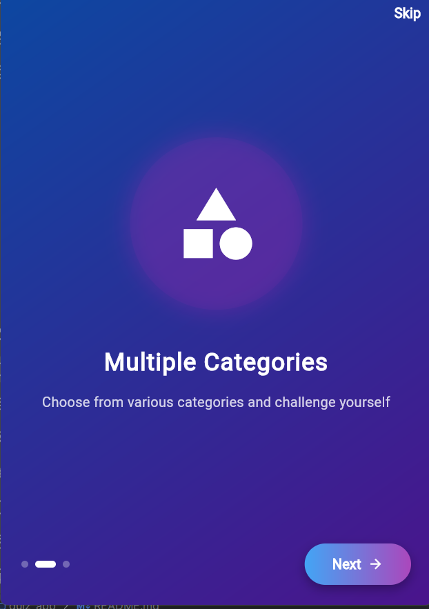
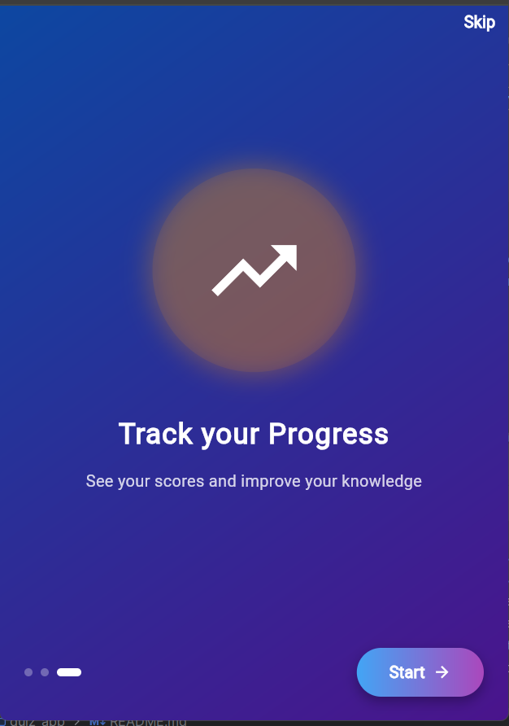
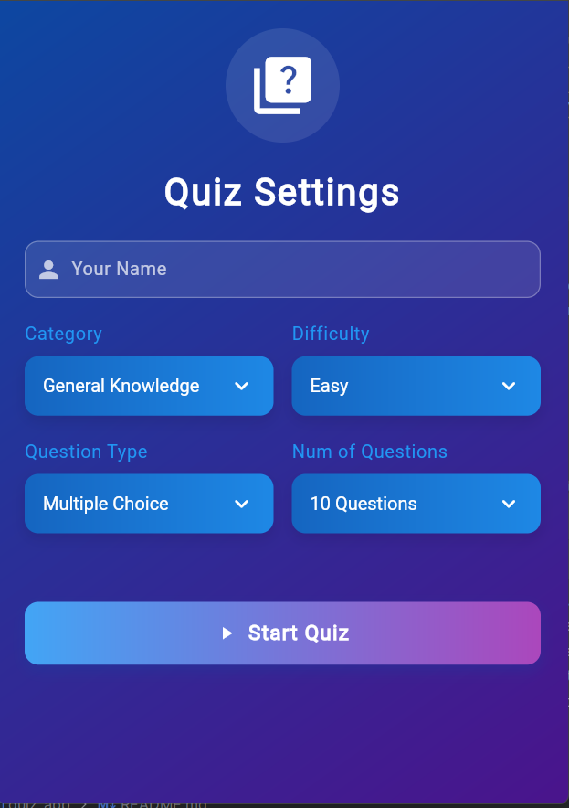
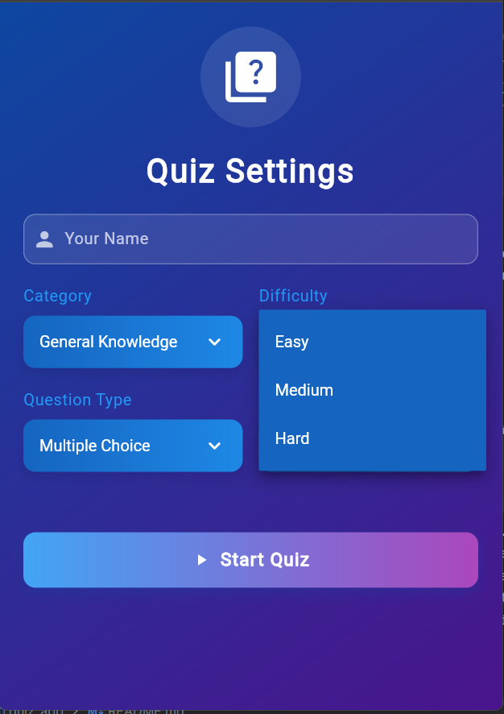
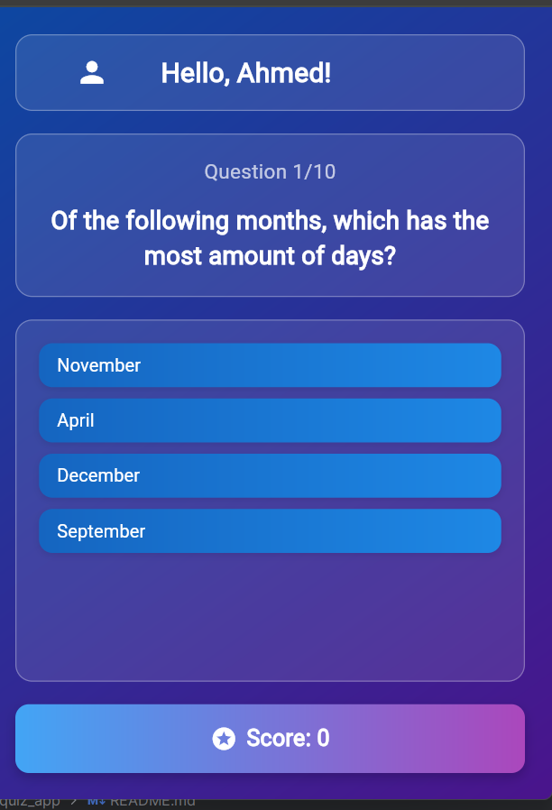
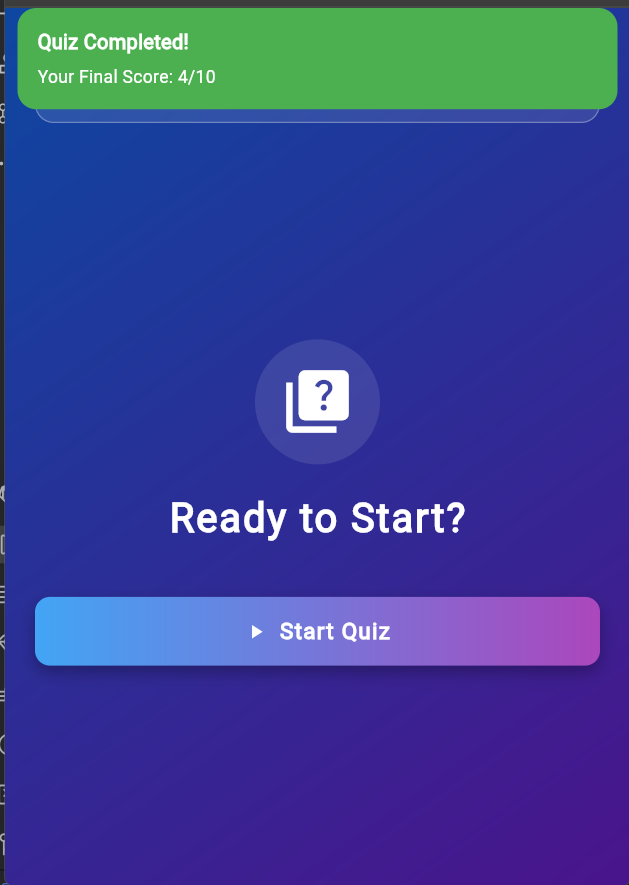

# Quiz App 📱

A modern and interactive Quiz application built with Flutter and GetX. Test your knowledge across various categories with different difficulty levels.

## 🌟 Features

- Beautiful Onboarding: Smooth introduction to the app features
- Multiple Categories: Choose from various quiz topics
- Difficulty Levels: Easy, Medium, and Hard modes
- Question Types: Multiple choice and True/False questions
- Score Tracking: Monitor your performance in real-time
- Responsive Design: Works on both Android and iOS devices
- Animated UI: Engaging user interface with smooth animations

## 📸 Screenshots

### **🛠 Onboarding Screens**
| Onboarding 1 | Onboarding 2 | Onboarding 3 |  
|--------------|--------------|--------------|  
|  |  |  |  

---

### **⚙️ Quiz Settings Screens**
| Quiz Settings 1 | Quiz Settings 2                                          |  
|-----------------|----------------------------------------------------------|  
|  |  |  

---

### **📝 Quiz Screens**
| Quiz Screen 1 | Quiz Screen 2                                         |  
|--------------|-------------------------------------------------------|  
|  |  |  

---

### **🏆 Results Screen**
| Results Screen                                   |  
|--------------------------------------------------|  
|  |  

## 🛠️ Tech Stack

- Framework: Flutter
- State Management: GetX
- API: Open Trivia Database
- Architecture: MVC Pattern

## 🚀 Getting Started

### Prerequisites

- Flutter SDK (Version 3.0 or higher)
- Dart SDK (Version 2.17 or higher)
- Android Studio / VS Code
- Git

### Installation

1. Clone the repository
git clone https://github.com/AhmedSaleh74/Flutter-Quiz-Application.git

2. Navigate to project directory
cd quiz_app

3. Install dependencies
flutter pub get

4. Run the app
flutter run

## 📁 Project Structure

lib/
├── main.dart
├── models/
│   ├── onboarding_model.dart
│   ├── question_model.dart
│   ├── quiz_category.dart
│   ├── quiz_difficulty.dart
│   └── quiz_type.dart
├── screens/
│   ├── onboarding_screen.dart
│   ├── settings_screen.dart
│   └── quiz_screen.dart
├── services/
│   └── question_services.dart
└── widgets/
    ├── custom_dropdown.dart
    ├── answer_button.dart
    └── answer_listview.dart

## 🎯 Features in Detail

**Onboarding**
Smooth introduction to app features
Animated transitions
Skip option available

**Quiz Settings**
Player name input
Category selection
Difficulty level selection
Question type selection
Number of questions selection

**Quiz Screen**
Real-time score tracking
Animated question transitions
Visual feedback for correct/incorrect answers
Final score display

## 🔧 Configuration

**API Configuration**
The app uses the Open Trivia Database API. No API key is required.
Base URL: https://opentdb.com/api.php

Dependencies
dependencies:
  flutter:
    sdk: flutter
  get: ^4.6.5
  http: ^1.1.0

## 📝 Usage
1. Launch the app
2. Go through the onboarding screens
3. Enter your name
4. Select quiz preferences:
   - Category
   - Difficulty
   - Question Type
   - Number of Questions
5. Start the quiz
6. Answer questions and track your score

## 👨‍💻 Author
Ahmed Mohamed Saleh

GitHub: https://github.com/AhmedSaleh74/
LinkedIn: https://www.linkedin.com/in/ahmed-saleh-054651219/
